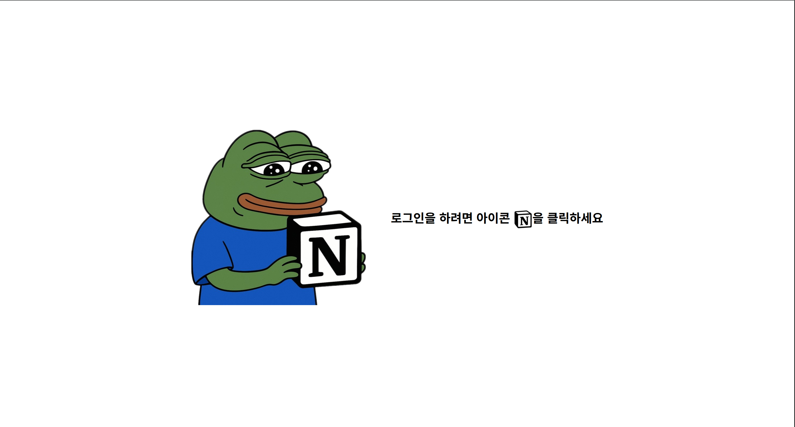
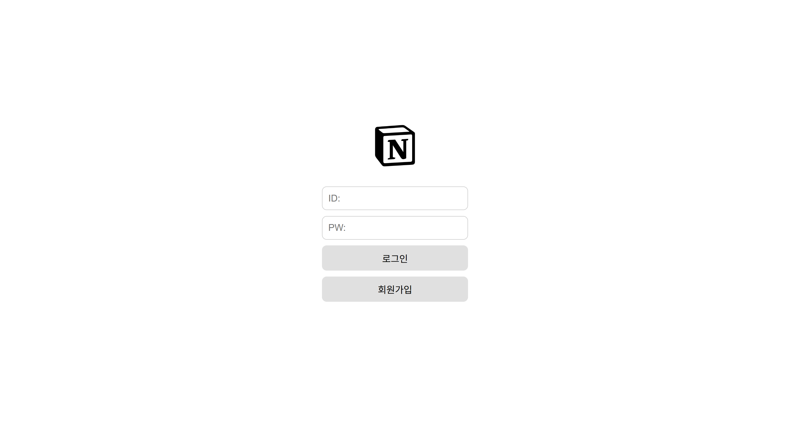
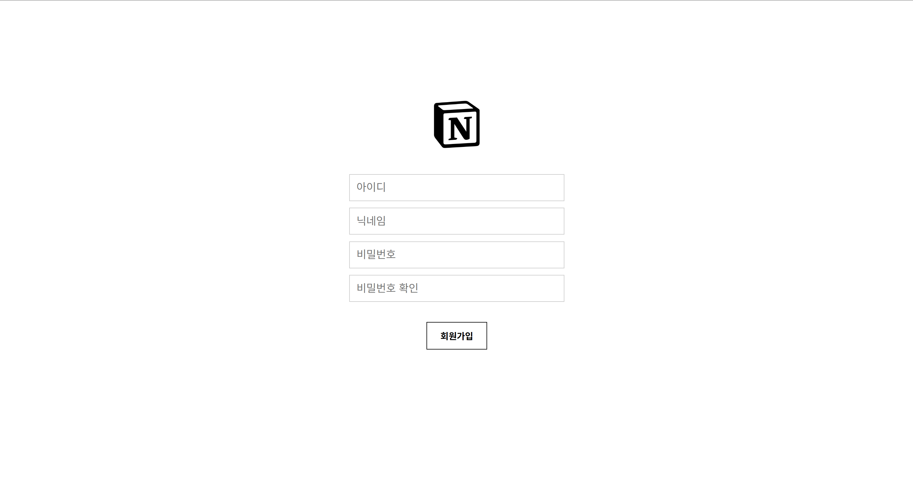
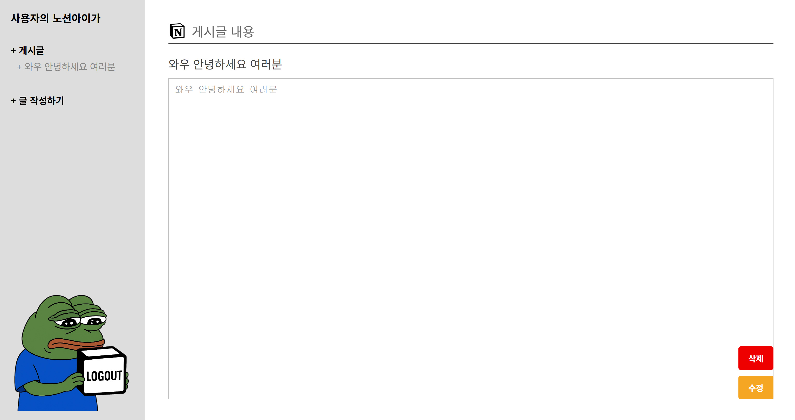
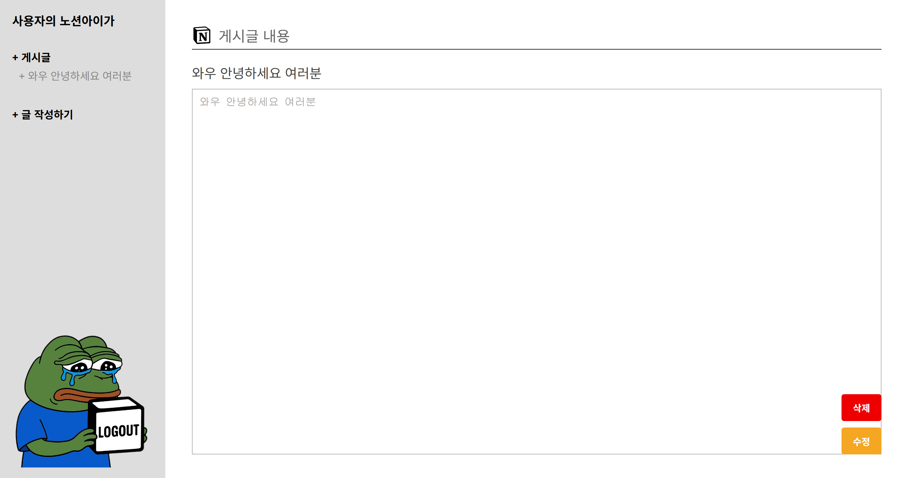

# Project: Notion AIGA

**노션 아이가(Notion AIGA)** 는 노션의 UI에서 영감을 받아 개발한 게시판 웹 프로젝트입니다.
'아이가'라는 이름에는 **두 가지 의미**가 담겨 있습니다.
첫째, **웹 프로젝트를 처음 해본 6명의 팀원**이 모여 **노션의 수준(“이거 우리가 만든 거 노션 아이가!”: 맞다)을 지향** 했다는 의미,
둘째, 실제로 우리가 만든 프로젝트의 수준은 **다소 부족할 수 있다는 점(“이거 노션 아이가?”: 노션 아니다)** 을 유쾌하게 표현했습니다.
**프로젝트 설계부터 최종 리뷰까지, 6명의 팀원이 정성을 담아 완성한 결과물입니다.**

---

## 문서 링크

## [https://www.notion.so/Notion-AIGA-234a3fb7419680d085eceab1eb19d7f5?source=copy_link](https://www.notion.so/Notion-AIGA-234a3fb7419680d085eceab1eb19d7f5?pvs=21)

## 시연 영상

## https://youtu.be/XSiDpRtzHwk?si=rTzKiUkNzh30UuRt


## <UI>

**시작 페이지**



**로그인 페이지**



**회원가입 페이지**



**게시글 내용**



**로그아웃 버튼 변화**



## 목차

- [소개](https://www.notion.so/readme-txt-23ba3fb74196800cade9c288431df5b8?pvs=21)
- [기능](https://www.notion.so/readme-txt-23ba3fb74196800cade9c288431df5b8?pvs=21)
- [설치 방법](https://www.notion.so/readme-txt-23ba3fb74196800cade9c288431df5b8?pvs=21)
- [사용한 기술 스택](https://www.notion.so/readme-txt-23ba3fb74196800cade9c288431df5b8?pvs=21)
- [Todo List](https://www.notion.so/readme-txt-23ba3fb74196800cade9c288431df5b8?pvs=21)
- [팀원소개](https://www.notion.so/readme-txt-23ba3fb74196800cade9c288431df5b8?pvs=21)

---

## 소개

Notion AIGA는 노션의 UI를 참고했지만, 노트 기능이 아닌 게시판 커뮤니티로 제작되었습니다.
이 커뮤니티를 통해 앞으로 팀원들이 서로의 소식을 공유하고, 즐길 수 있는 웹사이트로 발전시키는 것이 목표입니다.
현재는 기본적인 게시판 기능을 제공하지만, 앞으로 파이게임과 더 역동적인 UI를 접목해 퀄리티를 지속적으로 높여갈 계획입니다.

## 기능

- 로그인 / 로그아웃
- 회원가입
- 게시판 CRUD (Create, Read, Update, Delete)


## 디렉토리 구조

```
Notion_AIGA/
├── README.md
├── mini_project/
│   ├── requirements.txt
│   ├── database/
│   │   └── mydb.sql
│   └── project_file/
│       ├── manage.py
│       ├── aiga/
│       │   ├── models.py
│       │   ├── views.py
│       │   ├── urls.py
│       │   └── ...
│       ├── project_file/
│       │   ├── settings.py
│       │   ├── urls.py
│       │   └── ...
│       ├── static/
│       └── templates/
│           ├── index.html
│           ├── login.html
│           └── ...
└── UI/
    ├── 1.PNG
    ├── 2.PNG
    └── ...
```

## 사용한 기술 스택

- Python: 백엔드 및 웹 프레임워크 개발에 사용 (비즈니스 로직 및 서버 구현)
- Django: 웹 애플리케이션 프레임워크 (mini_project 내 myproject 등, 빠른 개발과 유지보수)
- HTML: 템플릿 파일에서 사용 (templates 폴더, 사용자 인터페이스 구성)
- MariaDB: 데이터베이스 (mini_project/database/mydb.sql, mysqlclient 패키지로 연동)
- mysqlclient: MySQL 데이터베이스 연동을 위한 Python 패키지 (DB 연결 및 쿼리 처리)
- 형상 관리: Github (코드 버전 관리 및 협업)
- 흐름도 그래픽 툴: [draw.io](http://draw.io/) (시스템 구조 및 흐름도 설계)

## 설치 방법


### 가상환경 설치
1. 터미널 위치 이동: cd .\mini_project\
2. 가상환경 생성: python -m venv myproject
3. (Windows PowerShell 기준) 가상환경 활성화: .\myproject\Scripts\Activate.ps1
4. 가상환경이 활성화된 상태에서 패키지 설치: pip install -r requirements.txt

### DB 설치 및 테이블 업로드, DB & 장고 연결
1. MariaDB 설치 및 DB 사용자 생성 (username: root, password: 1234 권장)
2. mini_project/database/mydb.sql 파일을 생성한 DB에 업로드(입력)
3. mini_project/project_file/project_file/settings.py의 DATABASES 설정을 본인 DB 환경에 맞게 수정

### 장고 데이터 마이그레이션 및 서버 실행
1. 터미널 위치 이동: cd mini_project/project_file
2. python manage.py makemigrations aiga
3. python manage.py migrate
4. python manage.py runserver

## 작업 기간

**07/21(월):** 최초 아이디어 회의, 문서 작업 디렉토리 구축

**07/22(화):** 담당 역할 수행, 의견 공유, 기본 설계

**07/23(수):** 최종 프로젝트 계획 수립, 기술 스택 선정, 버전 동기화

**07/24(목):** Github 저장소 충돌 문제 해결, 시작 페이지, 로그인, 회원가입 기능 완성, 전체 UI 완성

**07/25(금):** 로그아웃, 메인 게시판, 게시글 수정, 게시글 삭제

## Todo List

- 자유로운 메뉴 카테고리 생성 기능
- 사진 업로드 기능
- 채팅 기능
- 에추: 에이콘 추천 기능
- 반응형 UI 기능
- "글 작성하기" 버튼화

## 팀원소개

### @김규택(aka. 언제돼요?)

**역할:** 프로젝트 일정 관리, Django 멘토, Github 최초 공동 작업 환경 구축, DB 설계 가이드 제안, 시스템 흐름도 가이드 제안

**담당 기능:** 로그인, 회원가입, 로그아웃, 게시글 삭제&수정

**제작 문서:** 요구사항 정의서, 기능 명세서, 기능 별 시퀀스모델링, Django 역설계 교육 자료, 테스트케이스 문서

### @박세윤(aka. 머지세윤)

**역할:** Github 저장소 구축&관리, Django 멘토 Github 이슈 대응, 프로젝트 결과물 로컬 네트워크 연결, 모바일 접속 시연, 테스트 DB 데이터 구축, 시연 영상 제작

**담당 기능:** UI 디자인 개선, Django&MariaDB 직렬 통신 구축

**제작 문서:** Django 코드 설명 문서([views.py](http://views.py/), [urls.py](http://urls.py/), HTML), 트러블 슈팅, MariaDB 직접 연결 방식, Django 프로젝트 셋업, 개발 중 readme 문서, GitHub 메뉴얼, Git 실수 방지용 주의사항

### @박성재(aka. Sloth)

**역할:** 시스템 흐름도 제작 및 피드백 반영

**담당 기능:** 게시글 조회_사이드바, 게시글 조회_메인 , 전체 페이지 HTML 제작

**제작 문서:** 시스템 흐름도, 기능 별 시퀀스모델링

### @윤천희(aka. 겨울나무)

**역할:** DB 요구사항 분석 및 설계, MariaDB 사용 환경 구축

**담당 기능:** 게시글 조회, 게시글 조회_메인, 게시글 소개

**제작 문서:** DB 설계서, 기능 별 시퀀스모델링

### @하태우(aka. 꿀떡)

**역할:** UI/UX 기본 설계, 전체 기능 별 필요 버튼 디자인, 사용자 기반 UI 피드백

**담당 기능:** 전체 페이지 HTML 제작

**제작 문서:** 화면 설계서(UI/UX 와이어프레임)

### @김소영

**역할:** Javascript&Django&Python(pygame)&MariaDB 연동 교육 문서 제작, 사용자 기반 UI 피드백

**제작 문서:** [팀] GitHub 협업 워크플로우 맵_초딩, [팀] GitHub 형상관리 (GitHub 사용 계획), [팀] GitHub 협업 절차 종합 가이드 (Git Bash + VS Code), Git 명령어 모음집, Django or 기타_자세히, Django or 기타_요약, Node.js + Express.js
